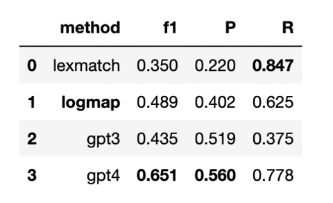

## Results

### Task

We generated 325 candidate lexical matches between FBbt and ZFA (see methods).

We ran these through MapperGPT.

We also ran LogMap over these two ontologies.

We treat entities linked via Uberon and CL as the Gold Standard.

### Core Results

