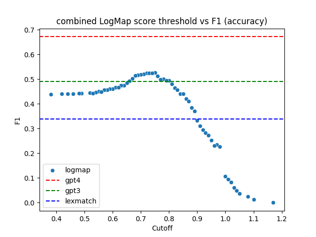
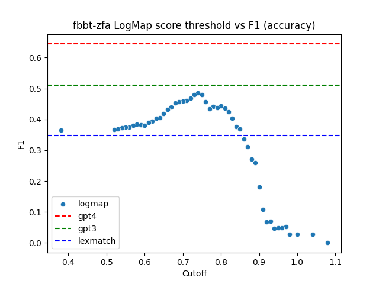
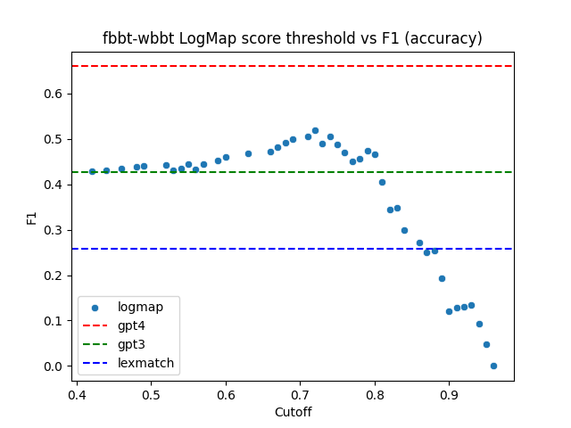
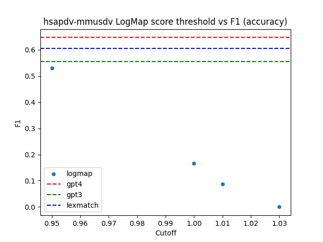
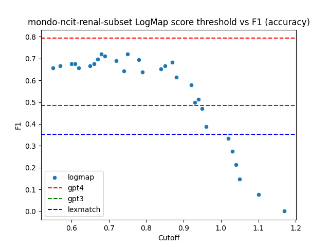

## Results

### MapperGPT with GPT4 improves on state of the art across all tasks

On all tasks combined, summarized in @tbl:combined-results, MapperGPT with GPT4 has an accuracy of 0.647, which is a considerable
improvement over the SOTA, demonstrating the validity of the approach.

{{main_results_combined}}

Table: Combined results over all tasks
{#tbl:combined-results}

LogMap returns a score rather than a binary answer - we took
the best performing cutoff. The distribution of F1 scores with
different thresholds are show in @fig:logmap-scatter-plot-combined.

{#fig:logmap-scatter-plot-combined height=3in}

### Anatomy Task Results

We assessed methods against an anatomy ontology matching task
containing all vetted mappings between the Fly anatomy ontology (FBbt) and the Zebra fish anatomy ontology (ZFA).

{{main_results_fbbt_zfa}}
Table: Results of *Drosophila* to *Danio rerio* anatomy matching
{#tbl:main_results_fbbt_zfa}

In this task, GPT-4 scored highest in both accuracy and precision.

{#fig:logmap-scatter-plot-fbbt-zfa height=3in}

We also assessed Fly to Worm:

{{main_results_fbbt_wbbt}}
Table: Results of *Drosophila* to *C elegans* anatomy matching
{#tbl:main_results_fbbt_wbbt}

{#fig:logmap-scatter-plot-fbbt-wbbt height=3in}

### Developmental Stage ontology task results

{{main_results_hsapdv_mmusdv}}
Table: Results of human developmental stages (HsapDv) vs mouse developmental stages (MmusDv)
{#tbl:main_results_hsapdv_mmusdv}

{#fig:logmap-scatter-plot-hsapdv-mmusdv height=3in}

### Disease matching task results

We evaluated methods against a disease ontology matching task, which was to match
all heritable renal diseases from Mondo to all renal diseases from NCIT.

{{main_results_mondo_ncit_renal_subset}}
Table: Results of MONDO vs NCIT (renal subset)
{#tbl:main_results_mondo_ncit_renal_subset}

{#fig:logmap-scatter-plot-mondo-ncit-renal-subset height=3in}

In this task, the previous SOTA achieves slight gain in precision over GPT based methods.
